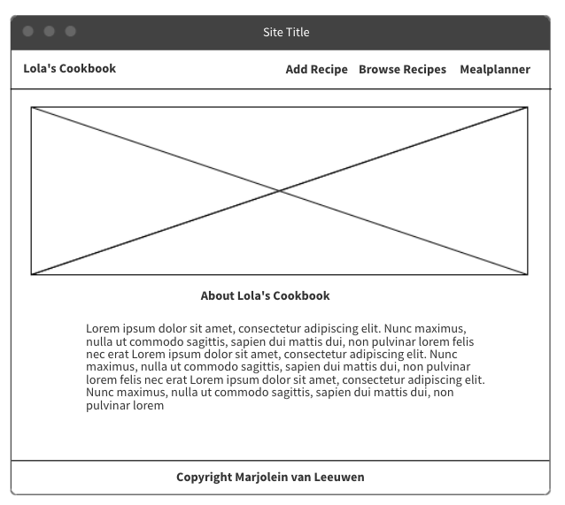
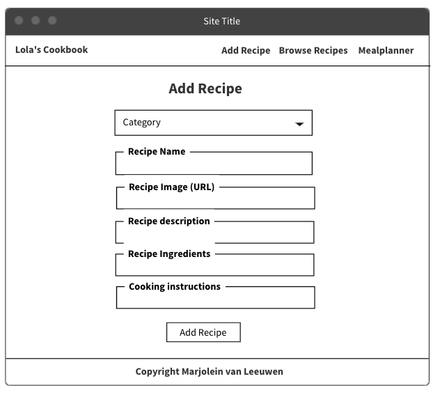
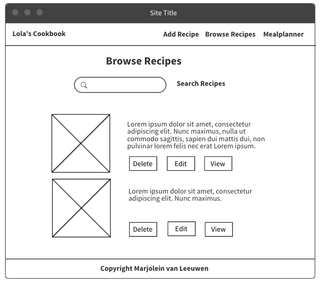
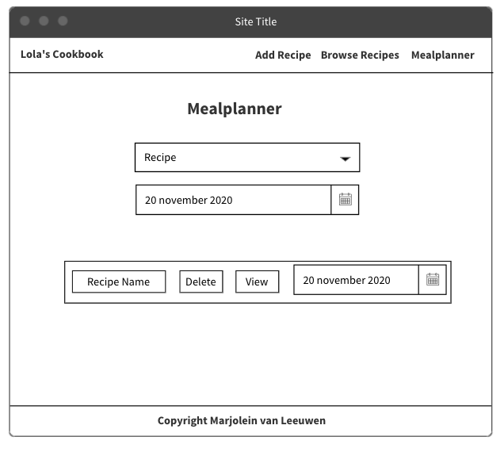

Lola’s Cookbook - Recipe Manager
---------------------------------------
**Data Centric Development - Marjolein van Leeuwen**

This is my Data Centric Development project. It's my 3rd milestone project for Code Institute.
I created Lola’s Cookbook for myself as a recipe manager so I could store my family’s recipes. I have called it Lola’s cookbook, because we always called my mother Lola and she had a real talent in Filipino cooking. I also created a mealplanner, so I can organize my favorite meals.

Click [here][DEMO] for my deployed project hosted on Heroku.

**User stories**

* As a user : As a new visitor to Lola's cookbook, I want the page to be easily navigated.
* As a user: As a new visitor I want clear instructions on how to add, view, update and delete recipes.
* As a user: I want a cookbook web app that responds quickly to my interaction.
* As a user: I want a search option so I can quickly find the recipe I'd like.
* As a user: I would like to easily organize my meals using the mealplanner

The ideal user:
* Someone who wants to store (family) recipes and likes to organize their meal with a mealplanner.

**Strategy**

* The goal of the website is to provide the visitor the option to create their own database of family recipes and organize them in a mealplanner.
* The websites focuses on 4 main categories of recipes: Breakfast, Lunch, Dinner & Dessert. 
* The user is allowed to both edit/update recipes based on their experience when preparing the meal but also delete unwanted recipes. 
* The add recipe form displays placeholder text in all of the formfields to give the user instructions for easier input.
* The edit recipe form is pre-populated with the recipe information that is pulled from the database.

**Database**

* The database chosen for this is a non-relational database hosted on MongoDB.
* The web application uses 3 database collections, 'categories', 'recipes' and 'mealplanner'.

**Skeleton** 

I created a wireframe using the program “Mockflow”. 

**Surface**

* For the surface plane I wanted the design to be minimilistic.
* The colors of my website are black, white, #efebe9 brown lighten-5 and #8d6e63 brown lighten-1
* The images carrousel is in color, so the cuisine pictures are more appealing to the eye.
* My images carroussel on the homepage is build with materialize code and is also touch compatible. 
* The images are pictures of Philipino Cuisine
* I choose the [Baloo+Tammadu][2] google font for my text on the website.
* Lola's cookbook brand-logo is written in the font [Dancing Script][3], because it looks like the handwriting of my mom lola.

**Technologies**

*Languages*
* HTML5
* CSS3
* Javascript
* Python3

*Libraries*
* Materialize
* FontAwesome
* jQuery
* Dnspython
* Flask
* Flask-PyMongo
* PyMongo

*Database*
* MongoDB

*Hosting*
* Github
* Heroku

**Features**

The website has been built with a mobile-first approach and is responsive.
This is achieved by using the front end framework from Materialize and custom-written css.

**CRUD functions**

***Users can add their favorite family recipes to the database and add a recipe with the mealplanner to their mealagenda. (Create)***

ADD RECIPES
* The Select Category field allows the user to select a category for the recipe. 
* The Recipe Name field allows the user to add a name/title of the recipe.
* The Recipe Image field allows the user to add a image link to the recipe image. 
* The Recipe Description allows users to write something short about the recipe.
* I added the family story, so it allows you to share the story behind the recipe and what memories it brings along.
* The Ingredients field allows the user to enter recipe ingredients. 
* The Cooking Instructions field allows the user to enter recipe instructions. 

MEALPLANNER
* The select recipe field allows the user to acces all the recipes stored in your recipes database and select a recipe.
* The datepicker field allows the user to select a date from an interactive calender.

The add recipes and mealplanner forms uses front-end materialize validation to make sure the user completes all mandatory formfields.

***Users can browse and search through all recipes contained in the database. (Read)***

BROWSE RECIPES
* Users can select to browse and search through all stored recipes by using the search bar. It allows the user to Reset and Search the Recipes.
* The recipes page displays a minimized view of all recipes (recipe cards) contained in the applicable category in the database (Title, Image, Description).
* On the Browse Recipes page, the user can select a specific recipe by clicking on the 'view' button and is then presented with a full-page view of the recipe and all its details.

MEAL AGENDA
* The meal agenda page shows all the recipe names and dates you added with the mealplanner. As a user you can choose to view the recipe from your mealagenda.

***Users can edit recipes in the database. (Update)***

EDIT RECIPES
* The Browse recipes page allows the user to edit a specific recipe by clicking on the 'edit' button. This takes the user to a form that is pre-populated with the recipe information which the user then can use to update the recipe. Once the user is done with editing the Recipe, the user can choose to cancel the edit or continue with updating the Recipe.

***Users can delete recipes in the database. (Delete)***

DELETE RECIPES
* The browse recipes page allows the user to immediately delete the recipe from the database.
* The mealagenda page allows the user to delete the recipe + date from their planning.

**Challenges**

* Building my mealplanner and meal agenda on one page was a difficulty for me. So I decided to first build 2 seperate pages: a mealplanner and a mealagenda. After I got the code for both pages work succesfully, I combined the two pages together in one page. But as a result my python code did not work properly and I could not get a correct connection with my recipes database. So I changed it all back to two seperate pages.
* Writing the code to view my recipe on a full page failed and after struggling with the code, I asked my mentor for help. 

**Testing**

**All testing carried out was done manually**
Testing problems I encountered:
* I was not able to view my recipe on a full page. My mentor Brian helped me to understand my python code and why it did not work. I used return redirect instead of render_template.

* Code Validation

* Responsive design

* Screen size testing

* Navigation

**Features Left to Implement**

Going forward I would like to implement the following features:

* Login and registration feature: Enabling users to create an account and log in.
* Storing user data: Storing user data (username) for each recipe, connecting the recipe to the user that created it.
* Rating feature: Enabling users to vote on recipes.

**Deployment**

The project is stored in a [GitHub repository][4] and hosted on Heroku.

I followed the next steps to deploy my game on the GitHub pages:

* Log into GitHub.
* Select Sweetzia/Lolas-Recipe-Manager in the repository list.
* Go to Settings
* Scroll down to the GitHub Pages section.
* Select the Master Branch
* On selecting Master Branch the page is automatically refreshed.
* The link can be retrieved to the deployed website.

I followed the next steps to host lola's cookbook on Heroku:
* Created a new application using the Heroku dashboard.
* Go to settings tab, click on 'reveal config vars' and add config vars such as IP (0.0.0.0), PORT (5000), MongoDB Name, MongoDB URI (URL with DB name and password).
* Log into Heroku via the gitpod terminal using 'heroku login -i' and follow the on screen instructions to log in.
* Create a requirements.txt using 'pip3 freeze > requirements.txt'.
* Create a Procfile using 'echo web: python app.py > Procfile'.
* Connect GitHub to Heroku in deployment method in Heroku
* Deploy project to Heroku in the Gitpod terminal using 'git push heroku master'.
* Open app in Heroku, succesfully deployed app!

**Credits**

**Content**

All of the text content on the website was written by me.

**Media**

* The recipe images used accross the page were obtained from Google Images.
* The carrousel images (philipino cuisine) were made by the photografers: Alex Lau and Stephanie Breijo
* The Macbook photo in my README.md was made by Ben Kolde from Unsplash and adjusted with a picture from my website with Pixlr.com.

**Acknowledgements**

I got inspiration from:

* The [VeggiePedia][8] example project from [Sascha Gogolin][0]
* The Data Centric Development mini project from the Code Institute Course: building a taskmanager application
* How to show confirm message before deleting a recipe or a mealplan: [stackoverflow.com][1]

***I want to thank my mentor Brian M for guiding me through the process of creating lola's cookbook and mealplanner.***
 
[DEMO]: <https://lolasrecipemanager.herokuapp.com/>
[0]: <https://github.com/3PU>
[1]: <https://stackoverflow.com/questions/9139075/how-to-show-a-confirm-message-before-delete>
[2]: <https://https://fonts.google.com/specimen/Baloo+Tammudu+2?sidebar.open=true&selection.family=Baloo+Tammudu+2>
[3]: <https://https://fonts.google.com/specimen/Dancing+Script?sidebar.open=true&selection.family=Dancing+Script:wght@600>
[4]: <https://github.com/Sweetzia/Lolas-Recipe-Manager>
[5]: <https://tastingtable.com>
[6]: <https://stemandspoon.com/>
[7]: <https://wikiwand.com>
[8]: <https://github.com/3PU/cook-book-milestone-project>

